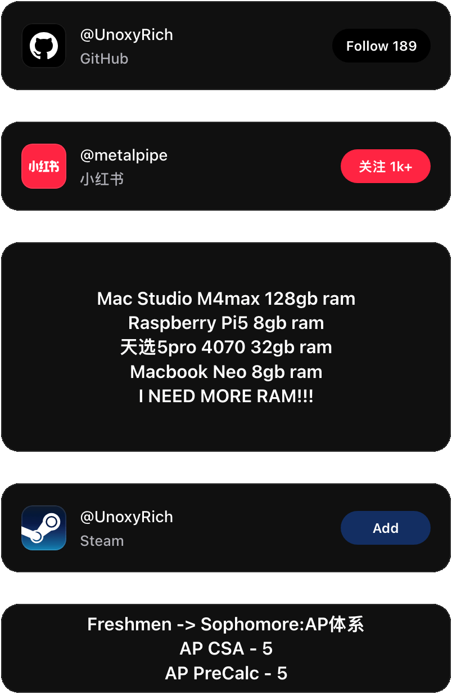
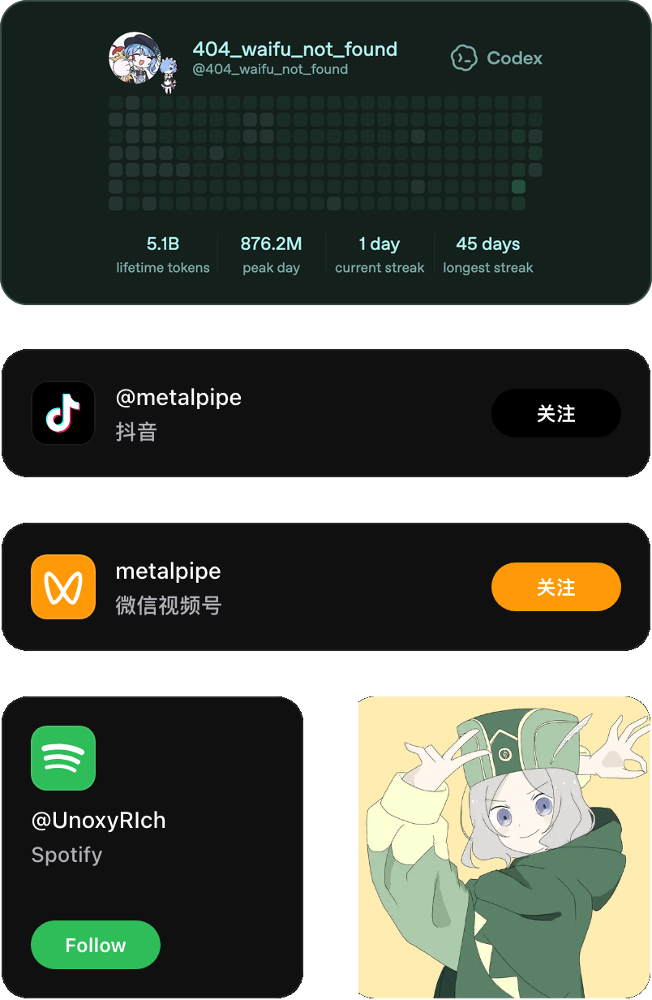

    
    
    
  

---

## Tools I use

<table align="center" width="100%">
  <tr>
    <td align="right" valign="middle" width="20%"><h3>Build</h3></td>
    <td align="left" valign="middle" width="80%">
      
      
      
      
      
      
      
    </td>
  </tr>
  <tr>
    <td align="right" valign="middle"><h3>Automate &amp; Ship</h3></td>
    <td align="left" valign="middle">
      
      
      
      
      
    </td>
  </tr>
  <tr>
    <td align="right" valign="middle"><h3>Create &amp; Work</h3></td>
    <td align="left" valign="middle">
      
      
      
      
      
      
    </td>
  </tr>
</table>

##  Metrics

<table align="center" width="100%">
  <tr>
    <td align="center" width="50%" valign="top">
      <h3>GitHub Metrics</h3>
      
    </td>
    <td align="center" width="50%" valign="top">
      <h3>Steam Recently Played</h3>
      
    </td>
  </tr>
</table>

  

