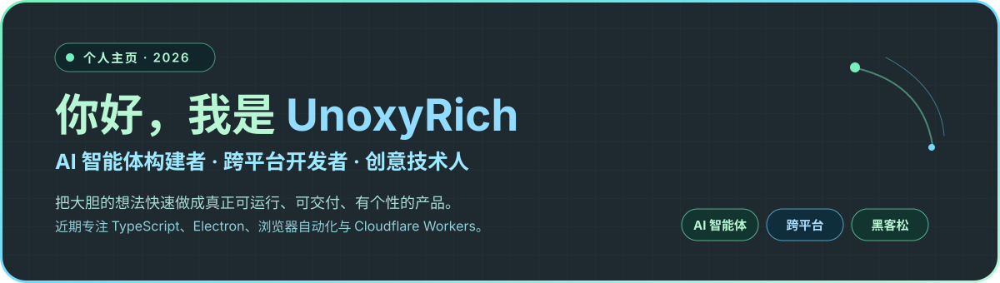
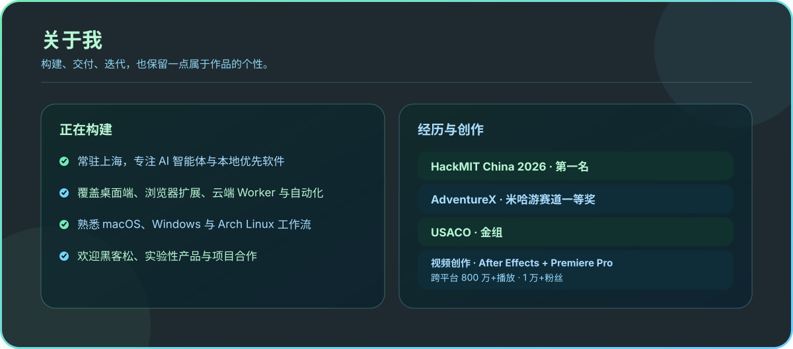
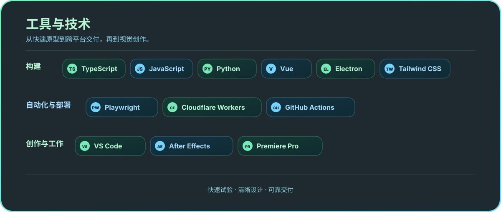

  

  

  

  

<table align="center" width="100%">
  <tr>
    <td align="center" width="50%" valign="top">
      
      
    </td>
    <td align="center" width="50%" valign="top">
      
      
    </td>
  </tr>
</table>

---

  

  
  
  
  
  

